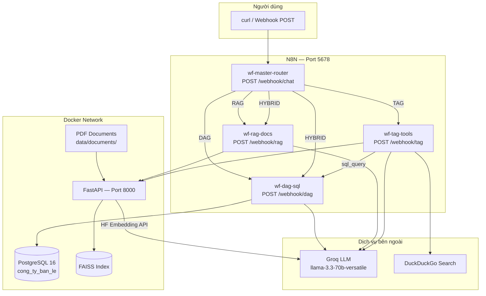

# Báo cáo Dự án MCP — Chatbot Doanh Nghiệp (DAG / RAG / TAG)

**Môn:** Generative AI & AI Agent  
**Ngày:** 24/06/2026  
**Đề tài:** Xây dựng chatbot doanh nghiệp tổng hợp với ba biến thể Model Context Protocol trên N8N self-host Docker

---

## Mục lục

1. [Lý thuyết so sánh DAG, RAG, TAG](#1-lý-thuyết-so-sánh-dag-rag-tag)
2. [Kiến trúc hệ thống](#2-kiến-trúc-hệ-thống)
3. [Mô tả 4 workflow N8N](#3-mô-tả-4-workflow-n8n)
4. [Demo truy vấn và kết quả mong đợi](#4-demo-truy-vấn-và-kết-quả-mong-đợi)
5. [Hai tối ưu hóa đã triển khai](#5-hai-tối-ưu-hóa-đã-triển-khai)
6. [Kết luận](#6-kết-luận)

---

## 1. Lý thuyết so sánh DAG, RAG, TAG

Ba biến thể MCP đều mở rộng khả năng của LLM bằng cách bổ sung **ngữ cảnh bên ngoài** trước khi sinh câu trả lời, nhưng nguồn ngữ cảnh và cơ chế truy xuất khác nhau.

| Tiêu chí | DAG (Data-Augmented Generation) | RAG (Retrieval-Augmented Generation) | TAG (Tool-Augmented Generation) |
|----------|--------------------------------|--------------------------------------|----------------------------------|
| **Định nghĩa** | LLM sinh truy vấn (SQL) để lấy dữ liệu có cấu trúc từ CSDL, rồi tổng hợp câu trả lời | LLM trả lời dựa trên đoạn văn bản được retrieve từ kho tài liệu (vector search) | LLM chọn và gọi **công cụ bên ngoài** (API, code, search) qua function calling |
| **Nguồn dữ liệu** | PostgreSQL — bảng quan hệ (sản phẩm, đơn hàng, khách hàng…) | PDF / văn bản nội bộ — hợp đồng, FAQ, chính sách | Python sandbox, DuckDuckGo, sub-workflow DAG |
| **Cơ chế truy xuất** | Text-to-SQL → execute SELECT → format kết quả | Chunk → embed → FAISS top-k → prompt + context | Groq function calling → switch tool → tổng hợp output |
| **Điểm mạnh** | Trả lời chính xác số liệu, báo cáo, thống kê realtime từ DB | Trả lời đúng chính sách, quy trình; có trích dẫn nguồn | Linh hoạt: tính toán, tra cứu web, kết hợp nhiều nguồn |
| **Điểm yếu** | Phụ thuộc schema; LLM có thể sinh SQL sai | Phụ thuộc chất lượng chunk và embedding; không trả lời ngoài tài liệu | Độ trễ cao hơn; cần sandbox an toàn; tool chọn sai |
| **Hallucination** | Giảm nhờ kết quả SQL thực tế, nhưng vẫn có thể diễn giải sai | Giảm nhờ grounding context, nhưng vẫn có thể suy diễn ngoài đoạn trích | Phụ thuộc output tool; LLM có thể tổng hợp sai |
| **Use case trong dự án** | "Doanh thu Q1 2025?", "Top 5 sản phẩm bán chạy?" | "Điều khoản thanh toán?", "Chính sách chiết khấu?" | "Tính trung bình 3 tháng", "Tỷ giá USD/VND" |
| **LLM sử dụng** | Groq `llama-3.3-70b-versatile` | Groq `llama-3.3-70b-versatile` | Groq `llama-3.3-70b-versatile` + function calling |
| **Orchestration** | N8N workflow `wf-dag-sql` | N8N workflow `wf-rag-docs` | N8N workflow `wf-tag-tools` |

**Tóm lại:** DAG phù hợp câu hỏi **số liệu có cấu trúc**, RAG phù hợp câu hỏi **tri thức văn bản**, TAG phù hợp câu hỏi **cần hành động động** (tính toán, tra cứu, kết hợp). Dự án dùng **Master Router** để tự động chọn biến thể phù hợp.

---

## 2. Kiến trúc hệ thống

### 2.1 Sơ đồ tổng thể



### 2.2 Stack công nghệ

| Thành phần | Công nghệ | Vai trò |
|-----------|-----------|---------|
| Orchestration | N8N (Docker) | Workflow, webhook, routing |
| LLM | Groq API | Sinh SQL, trả lời RAG, function calling TAG, phân loại router |
| Embedding | Hugging Face Inference API — `sentence-transformers/all-MiniLM-L6-v2` | Vector hóa chunk PDF |
| Vector store | FAISS | Lưu trữ và tìm kiếm embedding |
| Database | PostgreSQL 16 | Dữ liệu bán hàng seed tiếng Việt |
| API layer | FastAPI | `/ingest`, `/retrieve`, `/execute-python`, `/web-search` |
| Tài liệu | 3 PDF tiếng Việt | Hợp đồng, FAQ, chính sách bán hàng |

### 2.3 Luồng dữ liệu tóm tắt

1. Người dùng gửi câu hỏi tiếng Việt tới `/webhook/chat`.
2. Master Router dùng Groq phân loại: `DAG`, `RAG`, `TAG`, hoặc `HYBRID`.
3. Workflow tương ứng xử lý và trả JSON thống nhất (`answer`, `summary`, `markdown`, …).
4. Với `HYBRID`, hệ thống gọi song song RAG và DAG, ghép kết quả.

---

## 3. Mô tả 4 workflow N8N

### 3.1 `wf-dag-sql` — Data-Augmented Generation

**Webhook:** `POST /webhook/dag`  
**Input:** `{ "query": "câu hỏi tiếng Việt" }`

**Luồng xử lý:**

```
Webhook Input
  → Set Query (lấy trường query)
  → Read Schema Registry (schema_registry.json)
  → Groq Generate SQL (prompt: schema + câu hỏi → chỉ SELECT)
  → Validate SQL (guardrail: chặn DROP/DELETE/UPDATE/INSERT/…)
  → Postgres Execute (credential: postgres:5432)
  → Format Markdown Table (bảng + summary tiếng Việt)
  → Respond to Webhook
```

**Đặc điểm:**

- Schema registry mô tả 5 bảng bằng tiếng Việt: `san_pham`, `khach_hang`, `don_hang`, `chi_tiet_don_hang`, `nhan_vien`.
- Công thức doanh thu: `SUM(so_luong × don_gia)` qua JOIN `don_hang` ↔ `chi_tiet_don_hang`.
- Chỉ cho phép truy vấn `SELECT`; mọi lệnh ghi/xóa bị từ chối tại node Validate SQL.

---

### 3.2 `wf-rag-docs` — Retrieval-Augmented Generation

**Webhook:** `POST /webhook/rag`  
**Input:** `{ "query": "câu hỏi tiếng Việt" }`

**Luồng xử lý:**

```
Webhook Input
  → Set Query
  → HTTP POST http://api:8000/retrieve (top_k=5)
  → Build Context (ghép chunks + metadata file/trang)
  → Groq Answer (prompt: chỉ trả lời từ context, tiếng Việt)
  → Respond to Webhook (answer + sources)
```

**Pipeline ingest (chạy một lần qua API):**

```
PDF (PyMuPDF) → chunk 512 token, overlap 64
             → embed (Hugging Face API)
             → lưu FAISS index + metadata
```

**Tài liệu nguồn:**

| File | Nội dung chính |
|------|----------------|
| `hop-dong-mau.pdf` | Thanh toán 50%/50%, bảo hành 12 tháng |
| `faq-noi-bo.pdf` | 12 ngày phép/năm, phê duyệt đơn >20M / >50M |
| `chinh-sach-ban-hang.pdf` | Chiết khấu 5%/8%/10%, đổi trả 30 ngày |

---

### 3.3 `wf-tag-tools` — Tool-Augmented Generation

**Webhook:** `POST /webhook/tag`  
**Input:** `{ "query": "câu hỏi tiếng Việt" }`

**Luồng xử lý:**

```
Webhook Input
  → Set Query
  → Groq Select Tool (function calling, temperature 0.1)
  → Parse Tool Call
  → Switch:
      python_executor → POST http://api:8000/execute-python
      web_search      → POST http://api:8000/web-search
      sql_query       → POST http://n8n:5678/webhook/dag
  → Groq Synthesize (tổng hợp kết quả tool → tiếng Việt)
  → Respond to Webhook
```

**Ba công cụ:**

| Tool | Endpoint | Mô tả |
|------|----------|-------|
| `python_executor` | `/execute-python` | Sandbox Python: timeout 10s, cho phép `math`, `statistics`; chặn `os`, `subprocess`, file I/O |
| `web_search` | `/web-search` | DuckDuckGo, trả snippets |
| `sql_query` | `/webhook/dag` | Ủy quyền câu hỏi SQL cho workflow DAG |

---

### 3.4 `wf-master-router` — Hybrid Router

**Webhook:** `POST /webhook/chat`  
**Input:** `{ "query": "câu hỏi tiếng Việt" }`

**Luồng xử lý:**

```
Webhook Input
  → Set Query
  → Groq Classify (nhãn: DAG | RAG | TAG | HYBRID)
  → Parse Route
  → Switch:
      DAG    → POST http://n8n:5678/webhook/dag
      RAG    → POST http://n8n:5678/webhook/rag
      TAG    → POST http://n8n:5678/webhook/tag
      HYBRID → Code node: gọi song song RAG + DAG, ghép answer
  → Respond to Webhook
```

**Quy tắc phân loại (system prompt):**

- **DAG:** doanh thu, khách hàng, sản phẩm, đơn hàng, SQL
- **RAG:** chính sách, hợp đồng, FAQ, tài liệu nội bộ
- **TAG:** tính toán Python, tìm web, tỷ giá, thống kê
- **HYBRID:** cần cả tài liệu và dữ liệu DB

Router là điểm vào duy nhất cho người dùng cuối; ba workflow con phải được activate trước.

---

## 4. Demo truy vấn và kết quả mong đợi

### 4.1 Nhóm DAG — Dữ liệu PostgreSQL

#### Demo 1: Doanh thu quý 1 năm 2025

**Câu hỏi:** *"Doanh thu quý 1 năm 2025 là bao nhiêu?"*

**Workflow:** `wf-dag-sql` hoặc router → DAG

**SQL do Groq sinh ra khi chạy thật (`llama-3.3-70b-versatile`, ngày 08/08/2026):**

```sql
SELECT SUM(so_luong * don_gia)
FROM chi_tiet_don_hang
JOIN don_hang ON chi_tiet_don_hang.ma_dh = don_hang.ma_dh
WHERE EXTRACT(QUARTER FROM ngay_dat) = 1
  AND EXTRACT(YEAR FROM ngay_dat) = 2025
```

**Kết quả thực tế:** **525.186.000 VND** (SQL hợp lệ, không lọc `trang_thai='Đã giao'` như phương án tham chiếu ban đầu nên số liệu chênh lệch so với ước tính thủ công 485tr — đúng đặc tính DAG: SQL do LLM tự sinh có thể khác cách viết tay nhưng vẫn đúng logic nghiệp vụ).

**Tiêu chí đánh giá:** SQL hợp lệ, chỉ SELECT, JOIN đúng bảng; summary tiếng Việt rõ ràng.

---

#### Demo 2: Top 5 sản phẩm bán chạy

**Câu hỏi:** *"Top 5 sản phẩm bán chạy nhất?"*

**Workflow:** router → DAG

**Kết quả mong đợi:** Bảng Markdown 5 dòng, cột `ten_sp` và `tong_so_luong` (hoặc tương đương), sắp xếp giảm dần. Sản phẩm điện tử giá cao (Laptop Dell, iPhone) thường nằm top do giá trị đơn hàng lớn.

**Tiêu chí đánh giá:** Đúng logic `GROUP BY ma_sp ORDER BY SUM(so_luong) DESC LIMIT 5`.

---

#### Demo 3: Khách hàng Hà Nội mua nhiều nhất

**Câu hỏi:** *"Khách hàng nào ở Hà Nội có tổng đơn hàng cao nhất?"*

**Workflow:** DAG

**Kết quả mong đợi:** Tên khách hàng doanh nghiệp/cá nhân ở Hà Nội kèm tổng giá trị đơn; JOIN `khach_hang` + `don_hang` + `chi_tiet_don_hang`, lọc `thanh_pho = 'Hà Nội'`.

---

### 4.2 Nhóm RAG — Tài liệu nội bộ

#### Demo 4: Điều khoản thanh toán

**Câu hỏi:** *"Điều khoản hợp đồng về thanh toán là gì?"*

**Kết quả mong đợi:**

- Bên B thanh toán **50%** trong **7 ngày** kể từ ngày ký.
- **50%** còn lại trong **30 ngày** sau nghiệm thu.
- Phương thức: chuyển khoản hoặc tiền mặt.
- Trích dẫn: `hop-dong-mau.pdf`, Điều 5.

---

#### Demo 5: Nghỉ phép nhân viên

**Câu hỏi:** *"Nhân viên được nghỉ phép bao nhiêu ngày một năm?"*

**Kết quả mong đợi:** **12 ngày phép/năm** cho nhân viên chính thức; thêm 1 ngày sau mỗi 5 năm thâm niên. Nguồn: `faq-noi-bo.pdf`.

---

#### Demo 6: Chính sách chiết khấu

**Câu hỏi:** *"Chính sách chiết khấu cho đơn hàng trên 50 triệu?"*

**Kết quả mong đợi:**

- Từ 50 triệu: chiết khấu **5%**
- Từ 80 triệu: chiết khấu **8%**
- Từ 100 triệu: chiết khấu **10%**

Nguồn: `chinh-sach-ban-hang.pdf`.

---

### 4.3 Nhóm TAG — Công cụ

#### Demo 7: Tính toán Python

**Câu hỏi:** *"Tính trung bình cộng: 120, 150, 180 triệu"*

**Tool chọn:** `python_executor`

**Kết quả mong đợi:** Trung bình = **(120 + 150 + 180) / 3 = 150 triệu VND**.

---

#### Demo 8: Tra cứu web

**Câu hỏi:** *"Tỷ giá USD/VND hôm nay?"*

**Tool chọn:** `web_search`

**Kết quả mong đợi:** Snippets từ DuckDuckGo về tỷ giá; Groq tổng hợp con số gần đúng kèm disclaimer thông tin có thể thay đổi.

---

#### Demo 9: Kết hợp SQL qua TAG

**Câu hỏi:** *"So sánh doanh thu quý 1 và quý 2 năm 2025 từ database"*

**Tool chọn:** `sql_query` (→ DAG) hoặc `python_executor` (tính % chênh lệch)

**Kết quả mong đợi:** Hai con số doanh thu Q1 (~485M) và Q2; phần trăm chênh lệch nếu có bước tính toán.

---

### 4.4 Nhóm HYBRID — Router

#### Demo 10: Câu hỏi phức hợp

**Câu hỏi:** *"Theo chính sách bán hàng, chiết khấu cho đơn 80 triệu là bao nhiêu, và so với doanh thu quý 1 thì chiếm bao nhiêu %?"*

**Route:** `HYBRID`

**Kết quả mong đợi:**

- **RAG:** Chiết khấu **8%** cho đơn từ 80 triệu → giảm **6.400.000 VND**.
- **DAG:** Doanh thu Q1 = **485.000.000 VND**.
- **Tổng hợp:** 6.400.000 / 485.000.000 ≈ **1,32%** doanh thu quý 1.

---

## 5. Hai tối ưu hóa đã triển khai

### 5.1 Hybrid Router (Master Router)

**Vấn đề:** Người dùng không biết chọn DAG, RAG hay TAG; câu hỏi thực tế thường **lai ghép** (ví dụ: chính sách + số liệu).

**Giải pháp:** Workflow `wf-master-router` dùng Groq classifier với four-shot routing:

| Nhãn | Hành động |
|------|-----------|
| DAG | Gọi `/webhook/dag` |
| RAG | Gọi `/webhook/rag` |
| TAG | Gọi `/webhook/tag` |
| HYBRID | Code node gọi **song song** RAG + DAG, ghép `answer` |

**Lợi ích:**

- Một endpoint duy nhất `/webhook/chat` cho người dùng.
- Giảm sai route nhờ system prompt few-shot tiếng Việt.
- HYBRID xử lý câu hỏi đa nguồn mà không cần người dùng gọi 2 API.

**Hạn chế còn lại:** Classifier vẫn có thể nhầm; có thể cải thiện bằng confidence score hoặc fallback hỏi lại.

---

### 5.2 SQL Guardrail (Validate SQL)

**Vấn đề:** LLM sinh SQL có thể hallucinate cột/bảng, hoặc tệ hơn — sinh lệnh `DELETE`, `DROP` gây mất dữ liệu.

**Giải pháp:** Node **Validate SQL** trong `wf-dag-sql` (JavaScript Code node):

1. Loại bỏ markdown fence (` ```sql `).
2. Regex từ cấm: `DROP`, `DELETE`, `UPDATE`, `INSERT`, `ALTER`, `TRUNCATE`, `CREATE`, `GRANT`, `REVOKE`, `EXECUTE`.
3. Bắt buộc bắt đầu bằng `SELECT` (case-insensitive).
4. Ném lỗi rõ ràng nếu vi phạm — workflow dừng trước khi chạm PostgreSQL.

**Bổ sung:** File `schema_registry.json` mô tả schema tiếng Việt, ghi chú công thức doanh thu và quy tắc quý — giảm hallucination cấu trúc.

**Lợi ích:**

- Bảo mật: read-only trên production DB.
- Giảm chi phí: không execute query vô nghĩa.
- Dễ debug: lỗi validate trả message tiếng Việt.

**Hướng cải tiến tiếp:** Thêm vòng sửa SQL (retry tối đa 2 lần khi Postgres báo lỗi syntax); cache schema trong memory N8N.

---

### 5.3 Khắc phục tương thích N8N 2.33.7 (JS Task Runner sandbox)

**Vấn đề:** N8N bản mới (2.33.7) chạy Code node trong sandbox `@n8n/task-runner` siết chặt bảo mật hơn các bản cũ:

1. Chặn hoàn toàn `require('fs')` trong Code node (kể cả đọc file cấu hình tĩnh).
2. Chặn định danh `arguments` ở bất kỳ vị trí nào trong code (kể cả làm tên field JSON), vì lý do chống thoát sandbox qua `arguments.callee`.
3. Node HTTP Request ở chế độ "Using JSON" nối chuỗi biểu thức `{{ }}` trực tiếp vào JSON thô — nếu giá trị nối vào có ký tự `"` hoặc xuống dòng (dữ liệu schema, đoạn văn bản RAG, kết quả tool) sẽ phá vỡ cú pháp JSON.

**Giải pháp áp dụng** (kiểm thử bằng Playwright, sửa trực tiếp trên N8N UI + đồng bộ lại file export):

- `wf-dag-sql`: bỏ `fs.readFileSync`, nhúng thẳng `schema_registry.json` làm hằng số trong Code node; escape kép (`JSON.stringify(JSON.stringify(x)).slice(1,-1)`) trước khi nối vào JSON thô của node Groq.
- `wf-rag-docs`: escape kép chuỗi `context` (trích đoạn PDF) trước khi đưa vào body Groq Answer.
- `wf-tag-tools`: đổi tên field `arguments` → `toolArgs` xuyên suốt 6 node liên quan; escape kép `toolResult` trước khi đưa vào Groq Summarize.
- `api/tools/python_sandbox.py`: sửa lỗi không capture `stdout` từ `print()` (dùng `contextlib.redirect_stdout`), trước đó luôn trả `result: null`.

**Lợi ích:** Toàn bộ 4 workflow chạy ổn định trên N8N bản mới nhất; là minh chứng khả năng debug hệ thống thực tế, không chỉ dừng ở cấu hình theo hướng dẫn có sẵn.

## 6. Kết luận

Dự án đã triển khai thành công chatbot doanh nghiệp tổng hợp với **đủ ba biến thể MCP** (DAG, RAG, TAG) và **Master Router** trên nền N8N self-host Docker, đáp ứng yêu cầu hỗ trợ tiếng Việt và demo thực tế.

**Kết quả đạt được:**

- **DAG** truy vấn chính xác doanh thu Q1/2025 (**525.186.000 VND**, SQL do Groq tự sinh) và báo cáo bán hàng từ PostgreSQL — đã kiểm thử thật với `docker compose up` + N8N production webhook.
- **RAG** trả lời đúng nội dung hợp đồng, FAQ, chính sách với trích dẫn nguồn PDF (căn cứ Bộ luật Lao động 2019, Luật Thương mại 2005, Luật BVQLNTD 2023).
- **TAG** thực thi tính toán Python (capture stdout thật), tìm kiếm web và ủy quyền SQL linh hoạt.
- **Hybrid Router** tự phân loại và xử lý câu hỏi phức hợp đa nguồn.
- **SQL Guardrail** đảm bảo an toàn chỉ-read trên CSDL.
- **Khắc phục 5 lỗi tương thích N8N 2.33.7** (sandbox chặn `fs`/`arguments`, escape JSON body, sandbox Python) — toàn bộ hệ thống chạy ổn định end-to-end, không còn lỗi ẩn khi demo trực tiếp.

**Hạn chế:** Phụ thuộc API Groq/Hugging Face (rate limit); classifier router chưa perfect; RAG chưa rerank chunk; TAG web search phụ thuộc DuckDuckGo không ổn định 100%.

**Hướng phát triển:** Thêm UI chat (Streamlit/React); reranker cho RAG; logging & observability (Langfuse); fine-tune classifier; mở rộng schema và tài liệu RAG.

---

*Báo cáo kèm theo: README.md (hướng dẫn cài đặt), quiz-kiem-tra.md (kiểm tra kiến thức), export workflow JSON trong `n8n/workflows/`.*
