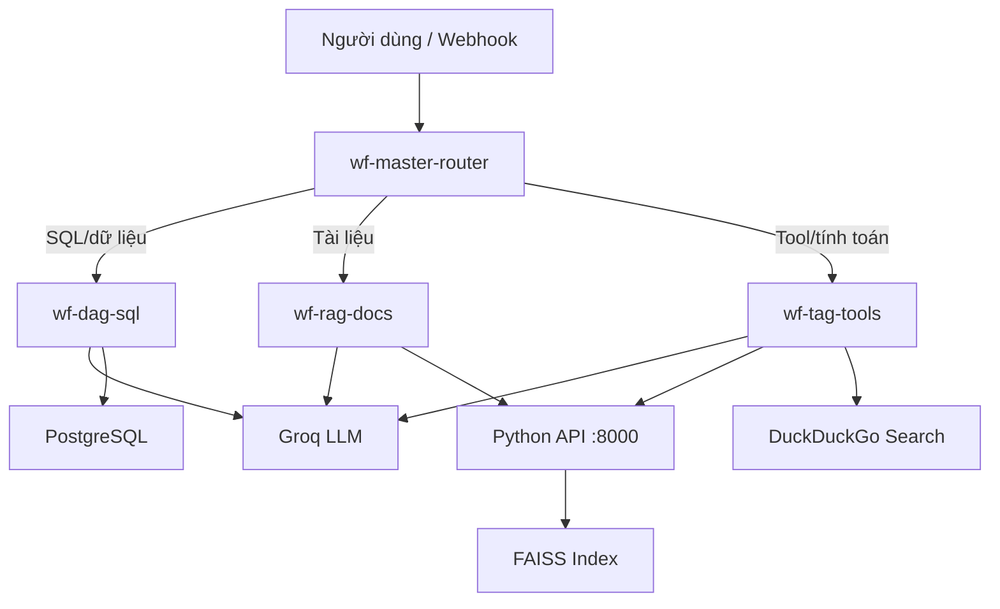

# Thiết kế: Model Context Protocol — DAG, RAG, TAG

**Ngày:** 2026-06-24  
**Trạng thái:** Đã duyệt  
**Mục tiêu:** Xây dựng chatbot doanh nghiệp tổng hợp với 3 biến thể MCP (DAG, RAG, TAG) trên N8N self-host Docker, kết hợp Python API và API miễn phí (Groq, Hugging Face).

---

## 1. Bối cảnh và phạm vi

### 1.1 Yêu cầu đề bài

- Ít nhất **1 workflow chạy được** cho mỗi biến thể: DAG, RAG, TAG
- **3 query thực tế** với độ chính xác >80%
- Hỗ trợ **tiếng Việt**
- **Báo cáo:** lý thuyết, workflow, demo, tối ưu (≥2 cải tiến)
- Môi trường: **N8N** + LLM qua API

### 1.2 Quyết định đã chốt

| Hạng mục | Lựa chọn |
|----------|----------|
| N8N | Self-host Docker trên Windows |
| LLM / Embedding | Groq + Hugging Face Inference API (miễn phí/rẻ) |
| Kịch bản | Doanh nghiệp tổng hợp (bán hàng + tài liệu nội bộ) |
| Kiến trúc | Phương án 2 Hybrid: N8N + PostgreSQL + Python FastAPI |
| Workflow | 3 workflow riêng + 1 Master Router |

---

## 2. Kiến trúc tổng thể



### 2.1 Stack công nghệ

| Thành phần | Công nghệ |
|-----------|-----------|
| Orchestration | N8N (Docker, port 5678) |
| LLM | Groq — `llama-3.3-70b-versatile` |
| Embedding | Hugging Face — `sentence-transformers/all-MiniLM-L6-v2` |
| Vector store | FAISS (trong Python API) |
| Database | PostgreSQL 16 — schema `cong_ty_ban_le` |
| Tài liệu RAG | 3 PDF tiếng Việt (hợp đồng, FAQ, chính sách) |
| TAG tools | Python sandbox, DuckDuckGo, sub-call DAG |

### 2.2 Services Docker

| Service | Image/Build | Port | Vai trò |
|---------|-------------|------|---------|
| `n8n` | `n8nio/n8n` | 5678 | UI + workflow |
| `postgres` | `postgres:16` | 5432 | DB DAG |
| `api` | `api/Dockerfile` | 8000 | RAG + TAG adapters |

---

## 3. DAG — Data-Augmented Generation

### 3.1 Database schema

Schema PostgreSQL `cong_ty_ban_le`:

- `san_pham` — `ma_sp`, `ten_sp`, `danh_muc`, `gia_ban`
- `khach_hang` — `ma_kh`, `ten_kh`, `thanh_pho`, `loai_kh`
- `don_hang` — `ma_dh`, `ma_kh`, `ngay_dat`, `trang_thai`
- `chi_tiet_don_hang` — `ma_dh`, `ma_sp`, `so_luong`, `don_gia`
- `nhan_vien` — `ma_nv`, `ten_nv`, `phong_ban`

~500 dòng seed data, có doanh thu theo quý 2025.

### 3.2 Workflow `wf-dag-sql`

```
Webhook Input
  → Load schema_registry.json
  → Groq: sinh SQL (SELECT only)
  → Validate SQL (chặn DROP/DELETE/UPDATE/INSERT)
  → Execute PostgreSQL
  → [Nếu lỗi] Groq sửa SQL (tối đa 2 vòng)
  → Format Markdown table + tóm tắt tiếng Việt
```

### 3.3 Schema registry

File `data/schema_registry.json` — mô tả bảng/cột bằng tiếng Việt cho LLM.

### 3.4 Query demo

1. "Doanh thu quý 1 năm 2025 là bao nhiêu?"
2. "Top 5 sản phẩm bán chạy nhất?"
3. "Khách hàng nào ở Hà Nội có tổng đơn hàng cao nhất?"

---

## 4. RAG — Retrieval-Augmented Generation

### 4.1 Tài liệu

| File | Nội dung |
|------|----------|
| `hop-dong-mau.pdf` | Điều khoản thanh toán, bảo hành |
| `faq-noi-bo.pdf` | Nghỉ phép, quy trình đặt hàng |
| `chinh-sach-ban-hang.pdf` | Chiết khấu, đổi trả |

### 4.2 Python API — ingestion

```
PDF → PyMuPDF extract
    → Chunk 512 token, overlap 64
    → Embed (Hugging Face API)
    → FAISS index + metadata (file, trang, đoạn)
```

Endpoints:
- `POST /ingest` — ingest toàn bộ PDF trong `data/documents/`
- `POST /embed` — embed một đoạn text
- `POST /retrieve` — top-k chunks

### 4.3 Workflow `wf-rag-docs`

```
Webhook Input
  → POST /retrieve (query, top_k=5)
  → Groq: prompt = context + câu hỏi + chỉ trả lời từ context
  → Trả lời + trích dẫn [file, trang]
```

### 4.4 Query demo

1. "Điều khoản hợp đồng về thanh toán là gì?"
2. "Nhân viên được nghỉ phép bao nhiêu ngày một năm?"
3. "Chính sách chiết khấu cho đơn hàng trên 50 triệu?"

---

## 5. TAG — Tool-Augmented Generation

### 5.1 Tools

| Tool | Input | Output |
|------|-------|--------|
| `python_executor` | `{ "code": "..." }` | `{ "result", "stdout" }` |
| `web_search` | `{ "query": "..." }` | `{ "snippets": [...] }` |
| `sql_query` | `{ "question": "..." }` | Kết quả từ wf-dag-sql |

Python sandbox: timeout 10s, chặn `os`, `subprocess`, file I/O; cho phép `math`, `statistics`, `pandas` cơ bản.

### 5.2 Workflow `wf-tag-tools`

```
Webhook Input
  → Groq function calling: chọn tool
  → Switch theo tool
  → Groq tổng hợp kết quả tiếng Việt
```

### 5.3 Query demo

1. "Tính doanh thu trung bình 3 tháng: 120, 150, 180 triệu" → python_executor
2. "Tỷ giá USD/VND hôm nay?" → web_search
3. "So sánh doanh thu quý 1 và quý 2 từ database" → sql_query + python_executor

---

## 6. Master Router — `wf-master-router`

```
Input query tiếng Việt
  → Groq classifier (few-shot):
      sql/dữ liệu      → wf-dag-sql
      tài liệu/chính sách → wf-rag-docs
      tính toán/web    → wf-tag-tools
      phức hợp         → chain RAG + DAG/TAG
  → Execute Workflow node
  → Response thống nhất
```

Query phức hợp ví dụ: *"Theo chính sách bán hàng, chiết khấu cho đơn 80 triệu là bao nhiêu, và so với doanh thu quý 1 thì chiếm bao nhiêu %?"*

---

## 7. Cấu trúc repository

```
bai-tap-cuoi-khoa/
├── docker-compose.yml
├── .env.example
├── README.md
├── api/
│   ├── Dockerfile
│   ├── requirements.txt
│   ├── main.py
│   ├── rag/
│   └── tools/
├── data/
│   ├── schema_registry.json
│   ├── init.sql
│   └── documents/
├── n8n/workflows/
│   ├── wf-dag-sql.json
│   ├── wf-rag-docs.json
│   ├── wf-tag-tools.json
│   └── wf-master-router.json
└── docs/
    ├── bao-cao.md
    ├── quiz-kiem-tra.md
    └── superpowers/
```

---

## 8. Xử lý lỗi

| Tình huống | Xử lý |
|------------|-------|
| Groq rate limit | Retry 2 lần, backoff; thông báo tiếng Việt |
| SQL sai | Validate + sửa tối đa 2 vòng |
| RAG không có chunk | "Không tìm thấy trong tài liệu nội bộ" |
| Python timeout/lỗi | Sandbox 10s, trả lỗi rõ ràng |
| Router sai | Few-shot + fallback hỏi lại |
| Thiếu API key | `/health` check khi start |

---

## 9. Đánh giá và deliverables

### 9.1 Metrics

| # | Query | Biến thể | Tiêu chí |
|---|-------|----------|----------|
| 1 | Doanh thu Q1 2025 | DAG | Khớp SQL |
| 2 | Điều khoản thanh toán | RAG | Đúng nội dung + nguồn |
| 3 | % doanh thu Q1 / tổng năm | TAG | Python đúng |

### 9.2 Cải tiến đề xuất

1. Hybrid RAG + TAG qua Master Router cho câu hỏi kết hợp
2. SQL guardrail + schema caching giảm hallucination

### 9.3 Nộp bài

- Repo/ZIP với docker-compose
- Workflow JSON export
- `docs/bao-cao.md` + screenshot N8N
- `docs/quiz-kiem-tra.md`

---

## 10. Thứ tự triển khai

1. Docker Compose + PostgreSQL seed
2. Python API (RAG + tools)
3. Workflow DAG → test
4. Workflow RAG → test
5. Workflow TAG → test
6. Master Router
7. Báo cáo + export workflow
